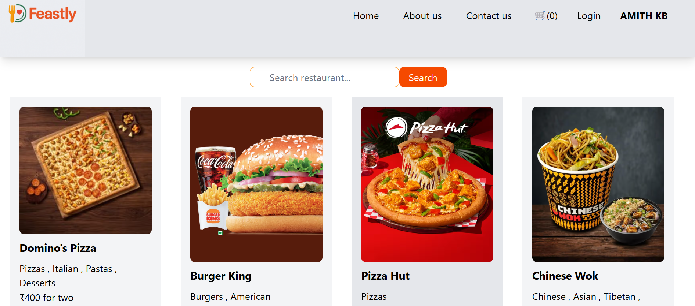

Feastly:- Food-Ordering-App
A Frontend food delivery application made using React and Swiggy's Live API.
_____________________________________________________________________________________________________________________________________________________________________________

Tech Stack :-
1. Frontend Library: React JS
2. Bundler: Parcel
3. Styling: Tailwind CSS
4. Testing: Jest
5. State Management: Redux-toolkit
_______________________________________________________________________________________________________________________________________________________________________________

Features:-
1. Shimmer UI
2. Add to cart
3. Get restaurants by current location from Swiggy API & getting the live data.
4. Display them with Area name, Cuisines Category and Ratings.
5. Search Restaurants by Name.
6. For any restaurant, you can checkout all the different type of dishes available with details and prices per quantity.
_______________________________________________________________________________________________________________________________________________________________________________

How to run on your local
1. Clone the repo
git clone
2. Install dependencies
npm install
3. Start the dev server
npm start
Make sure you've enabled CORS extension installed in your browser while fetching Swiggy Live API

Drop ⭐ if you like the Repository
Screenshots:-
## 🖼️ Feastly App Screenshots
### View all restaurants

_______________________________________________________________________________________________________________________________________________________________________________

### Pick a restaurant

_______________________________________________________________________________________________________________________________________________________________________________
### Add the items to cart

